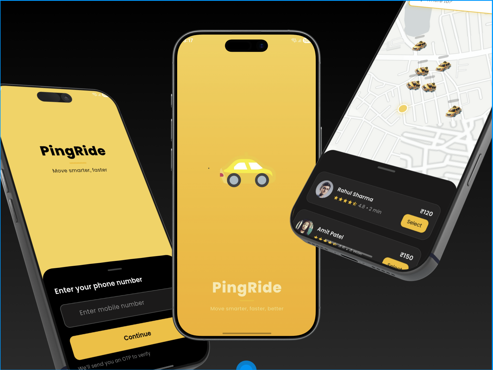

# 🚕 PingRide – Ride Booking App

PingRide is a simple ride-booking mobile app built using Flutter.
It includes phone login with OTP and a map-based home screen.

---

## ✨ Features

* Phone Authentication (Firebase OTP)
* Map Integration (OpenStreetMap)
* Nearby Drivers UI
* Clean and modern design

---

## 📱 App



---

## 🛠️ Tech Stack

* Flutter
* Firebase Authentication
* OpenStreetMap

---

## 🚀 Run the App

```bash
git clone https://github.com/vishalpatel011/pingride-app.git
cd pingride-app
flutter pub get
flutter run
```

---

## 👨‍💻 Author

Vishal Patel
